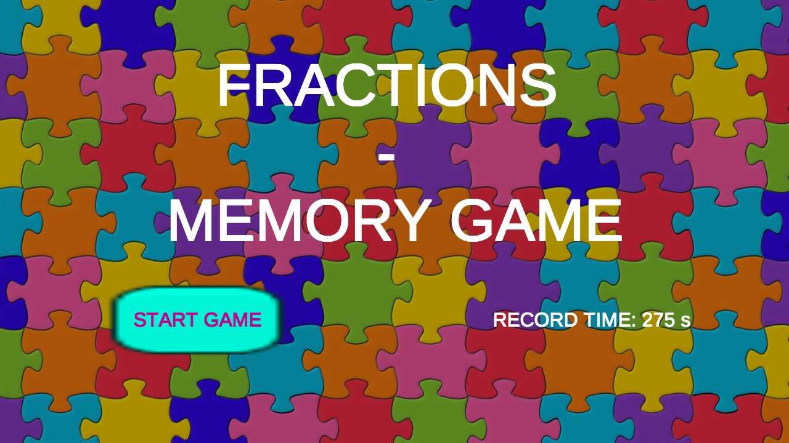
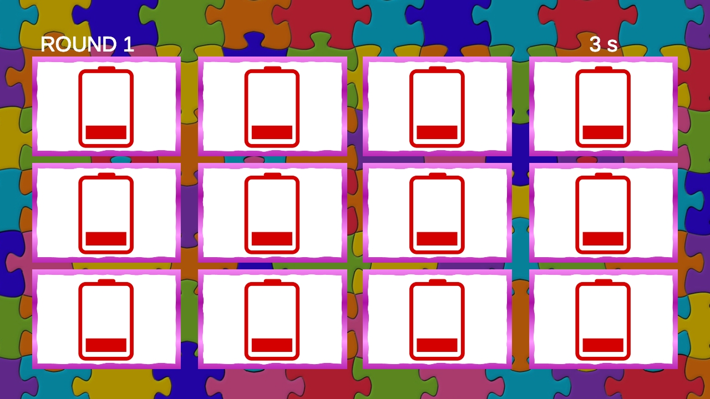
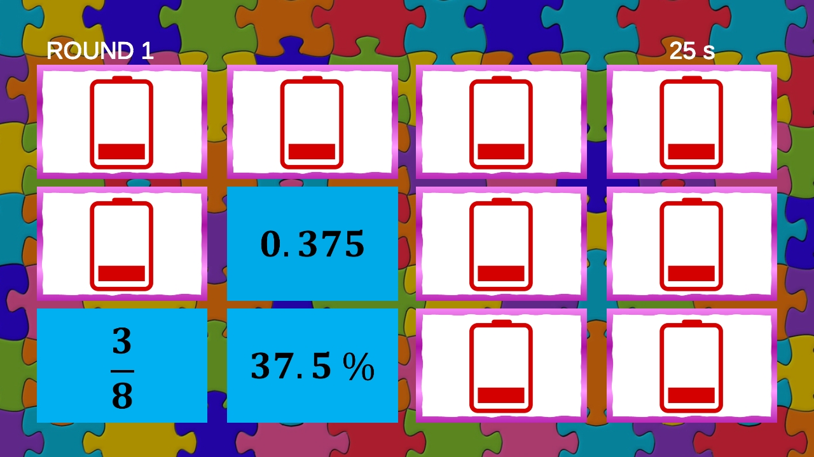
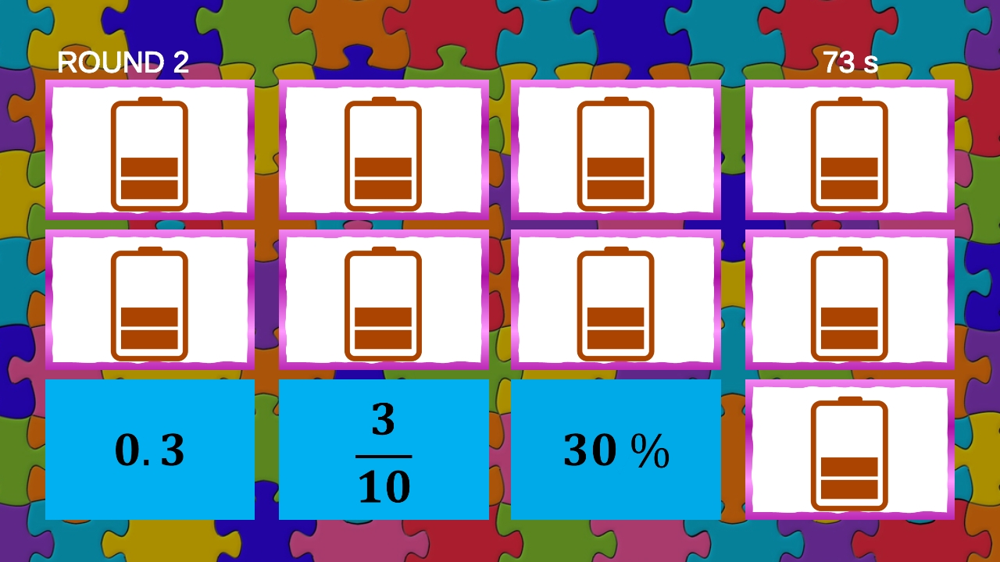
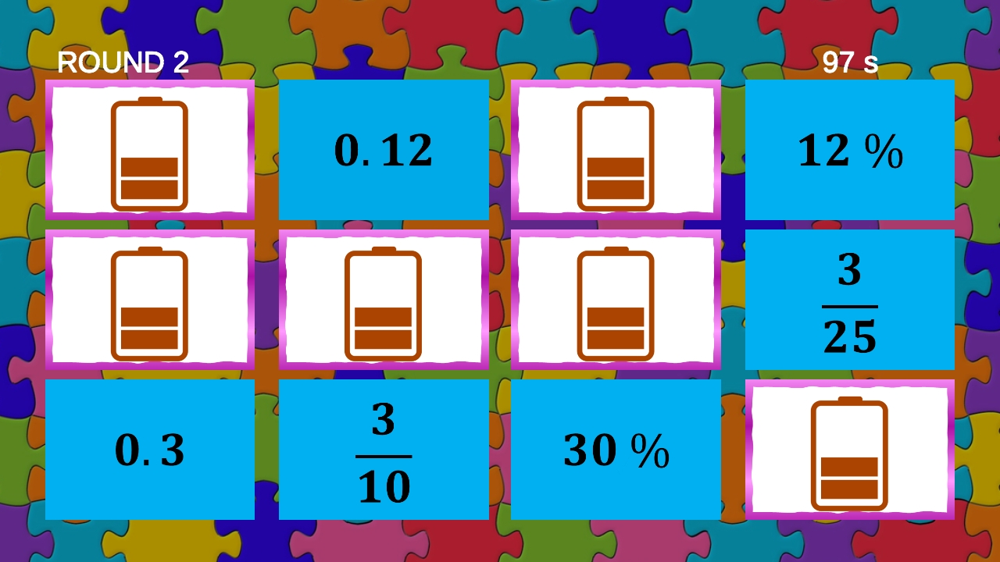
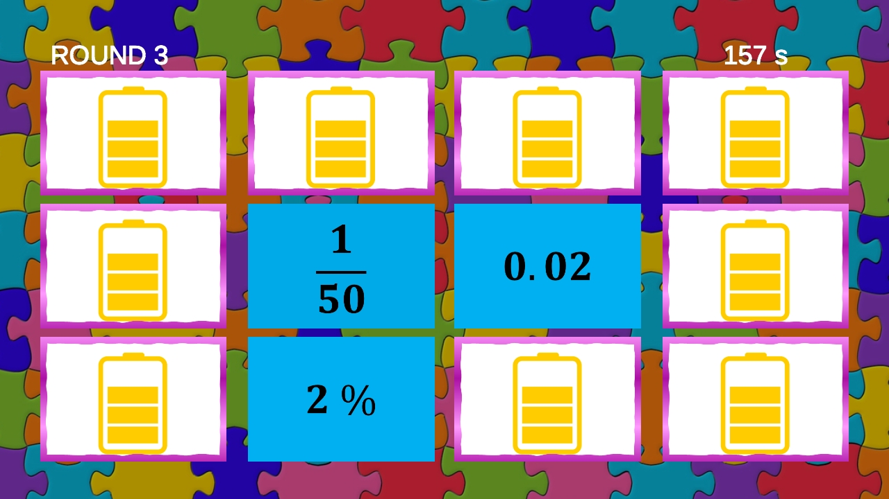
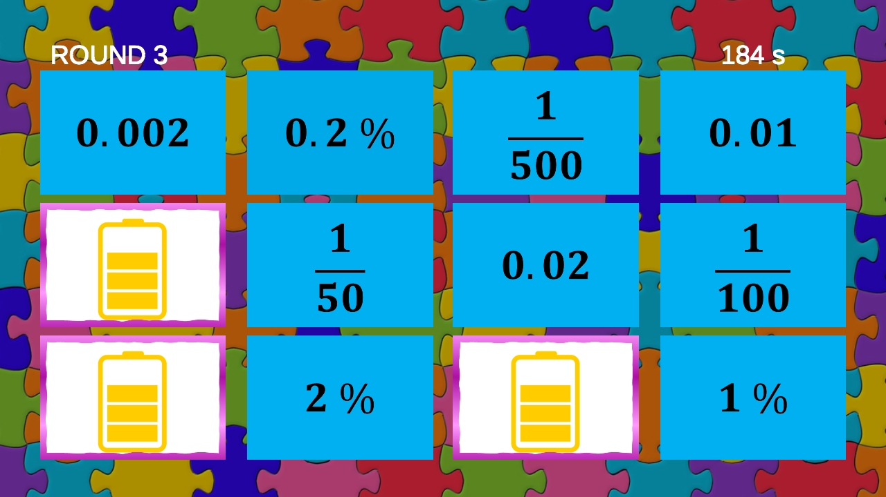
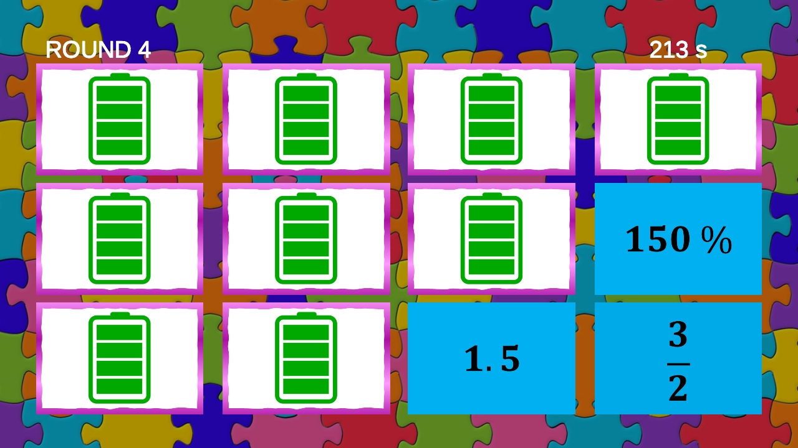
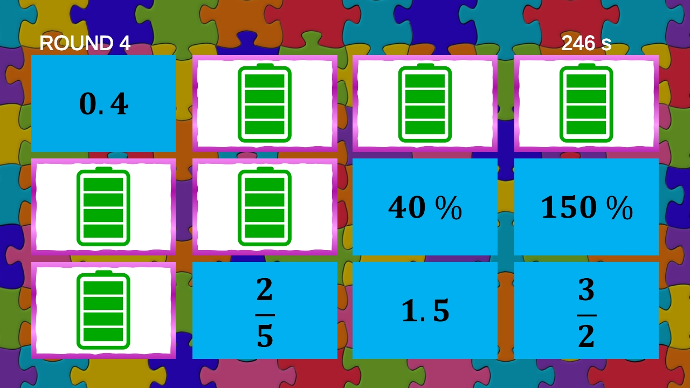
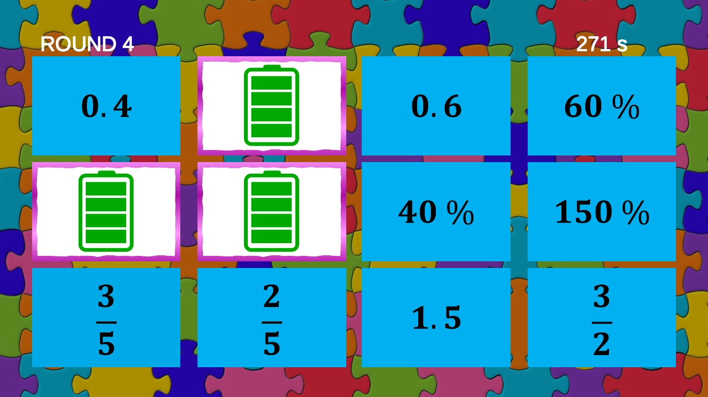

# Fractions - Memory Game

Welcome to the Fractions - Memory Game project! This is a fun and educational math learning game that helps players practice conversions between fractions, decimals, and percentages.

## Game Description

The game is a memory game where players flip cards from a set of 12 cards. The goal is to find matching triplets: a fraction, a decimal, and a percentage. This game not only enhances memory skills but also reinforces math skills in an engaging and interactive way.

## Game Rules

- One game consists of four sets of 12 cards.
- Players compete against the clock, so speed and accuracy are key to winning.
- Strategies for flipping cards and finding conversions are important for success.

## Features

- Practice fractions, decimals, and percentages.
- Challenge yourself and your friends against the clock.
- Develop memory and math skills simultaneously.

## Additional Information

If you have any questions or suggestions, feel free to reach out or open issues in this repository.

Welcome to play and learn!

## Screenshots

## Also available for Android devices

